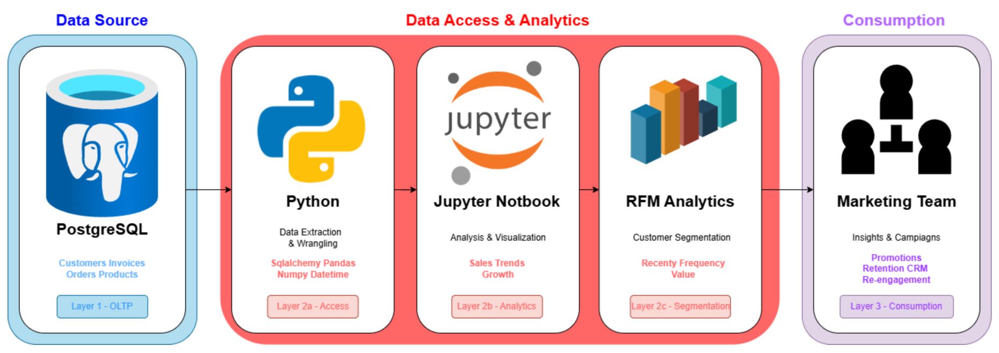

# Retail Data Analytics Project

## Introduction

The London Gift Shop (LGS) is a UK-based online retailer that sells gifts for various occasions. Although the company has accumulated years of sales data, it has not fully leveraged this information to better understand customer behavior.

This project addresses that gap by implementing a comprehensive data analytics solution. Raw transactional data is ingested into a structured Data Warehouse, enabling deeper analysis of shopping patterns. Using RFM (Recency, Frequency, Monetary) segmentation, customers are grouped based on purchasing behavior, allowing the marketing team to make data-driven decisions.

By adopting this approach, LGS can move from intuition-based marketing to targeted strategies that improve customer retention, engagement, and revenue growth.

---

## Technologies Used

- **Docker** — Containerizes the database and analytics environment for portability and consistency
- **PostgreSQL** — Serves as the Data Warehouse for storing retail transaction data
- **Jupyter Notebook** — Interactive environment for analysis and visualization
- **Python** — Primary programming language for the analytics workflow
- **Pandas & NumPy** — Used for data cleaning, transformation, and analysis

---

## Implementation

### Project Architecture

The solution follows a standard data analytics pipeline:

1. **LGS Web App**  
   Source of raw transactional data (provided as a SQL dump file)

2. **PostgreSQL Data Warehouse**  
   Hosted in a Docker container to store and manage cleaned data

3. **Jupyter Notebook**  
   Connects to the warehouse to extract data, perform analysis, and generate visualizations

4. **End Users (Marketing Team)**  
   Consume dashboards and customer segmentation insights

---

## Data Analytics and Wrangling

The complete analysis and implementation details are available in the notebook:

- **Retail Data Analytics Notebook**  
  `./retail_data_analytics_wrangling.ipynb`

### Business Impact & Strategy

Using **RFM analysis**, customers were segmented into groups such as:

- Champions
- Potential Loyalists
- Hibernating

These segments enable targeted business actions:

#### Marketing Opportunities

- Re-engage **Hibernating** customers with win-back campaigns (e.g., “We miss you” promotions)
- Deliver personalized offers based on purchasing behavior

#### Retention Strategy

- Reward **Champions** with early access to new products or exclusive perks
- Maintain high customer lifetime value through loyalty initiatives

---

## Future Improvements

Given additional time, the following enhancements could further strengthen the solution:

### 1. Automate the ETL Pipeline

The current data loading process is manual. Future work would include:

- Building a Python ETL pipeline
- Automatically ingesting new CSV files from the web application
- Scheduling daily data loads into the warehouse

### 2. Cloud Deployment

To improve accessibility and scalability:

- Deploy Docker containers to a cloud platform (e.g., AWS EC2)
- Enable 24/7 access for the analytics and marketing teams
- Improve reliability and collaboration

---